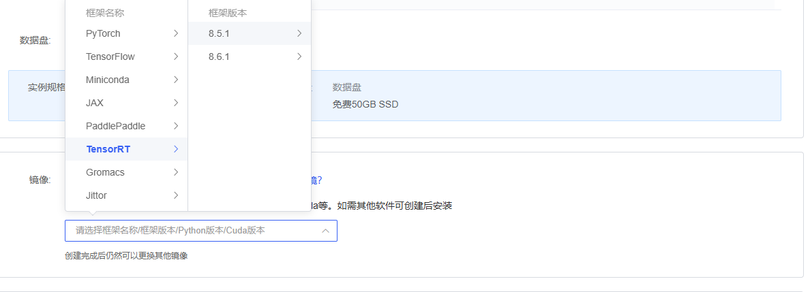

# TensorRT
TensorRT quick start, implemented by autodl.

## Configuration

**Step1.** choose the TensorRT Framework in [autodl](https://www.autodl.com). 

**Step2.** Install some packages, install what is missing. It depends on your personal needs. You can also refer to my environment in the `requirement.txt`.

## Run

**Step1.** run the `export.py`.

**Step2.** Execute this command on the terminal:` trtexec --onnx=model.onnx --saveEngine=model.trt --fp16`.

**Step3.** run the `evaluate.py`.

## Test Throughout and Latency

run the `main.py`.

## Acknowledgement

Many thanks to ([PriceYH (HaoYu)](https://github.com/PriceYH)) for his help!
